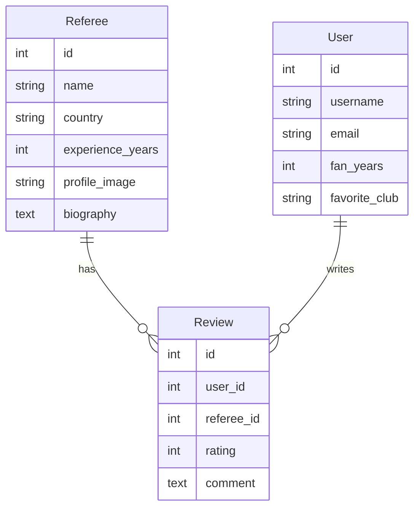

# Referee Info App

海外サッカーをネット中継で観戦する際に、審判の詳細情報や判定傾向を確認できるWebアプリケーションです。

---

## 🌟 サービス概要

海外サッカー観戦時に「この審判は誰？」「どんな判定傾向？」という疑問を持つファンに  
審判の詳細情報と過去のデータ分析を提供する  
サッカーファン向け審判情報プラットフォームです。

---

## 🎯 メインターゲットユーザー

- 海外サッカーをネット中継で観戦するファン
- 審判の判定傾向を知りたいサッカー愛好家
- より深くサッカーを理解したい観戦者

---

## 📊 主要機能

### コア機能
- **審判プロフィール表示**
  - 出身国・経歴・顔写真
  - 担当リーグ・国際試合経験
- **判定傾向分析**
  - カード提示傾向（イエロー/レッド）
  - ファウル判定の厳格度
  - VAR使用頻度
- **ファン評価システム**
  - 審判への評価・コメント機能
  - 試合ごとのレーティング
- **ユーザー管理**
  - ユーザー登録・ログイン
  - プロフィール設定（ファン歴・お気に入りクラブ）

### 追加機能（今後実装予定）
- **実績システム**
  - 観戦バッヂ・評価バッヂ
  - ファンレベル表示
- **ソーシャル機能**
  - ユーザー間フォロー
  - 審判評価の共有

---

## 🛠 技術スタック

- **フレームワーク**: Ruby on Rails 7.x
- **言語**: Ruby 3.x
- **データベース**: PostgreSQL
- **コンテナ**: Docker / Docker Compose
- **テスト**: RSpec
- **スタイル**: SCSS

---

## 🚀 セットアップ

### 必要な環境
- Docker Desktop 4.0以上
- Git
- ブラウザ（Chrome, Firefox, Safari等）

### 環境構築手順

1. リポジトリをクローン
   ```bash
   git clone https://github.com/umizu-commits/referee-info-app.git
   cd referee-info-app
   ```

2. Dockerコンテナを起動
   ```bash
   docker compose up -d
   ```

3. データベースをセットアップ
   ```bash
   docker compose exec web rails db:create
   docker compose exec web rails db:migrate
   docker compose exec web rails db:seed
   ```

4. アプリケーションを起動
   ```bash
   docker compose exec web bin/dev
   ```

5. ブラウザで確認  
   [http://localhost:3000](http://localhost:3000)

---

## 🎯 初期ログイン情報

**Email**: `test@example.com`  
**Password**: `password123`

---

## ❗ トラブルシューティング

- **ポート3000が使用中の場合**
  ```bash
  # 使用中のプロセスを確認
  lsof -i :3000

  # 別のポートで起動（例: 3001）
  docker compose exec web rails server -p 3001
  ```

- **Dockerコンテナが起動しない場合**
  ```bash
  # コンテナの状態確認
  docker compose ps

  # ログの確認
  docker compose logs web

  # コンテナの再ビルド
  docker compose build --no-cache
  docker compose up -d
  ```

---

## 🧪 テスト実行

- 全テスト実行
  ```bash
  docker compose exec web bundle exec rspec
  ```

- 特定のテスト実行
  ```bash
  docker compose exec web bundle exec rspec spec/models/
  ```

---

## 🗄 データベース設計

### テーブル定義

**Referee（審判情報）**
| カラム名          | データ型   | 説明               |
|-------------------|------------|--------------------|
| id                | integer    | 主キー             |
| name              | string     | 審判名             |
| country           | string     | 出身国             |
| experience_years  | integer    | 経験年数           |
| profile_image     | string     | プロフィール画像URL |
| biography         | text       | 経歴・プロフィール |

**User（ユーザー情報）**
| カラム名        | データ型   | 説明               |
|-----------------|------------|--------------------|
| id              | integer    | 主キー             |
| username        | string     | ユーザー名         |
| email           | string     | メールアドレス     |
| fan_years       | integer    | ファン歴           |
| favorite_club   | string     | お気に入りクラブ   |

**Review（審判評価）**
| カラム名   | データ型   | 説明                     |
|------------|------------|--------------------------|
| id         | integer    | 主キー                   |
| user_id    | integer    | ユーザーID（外部キー）   |
| referee_id | integer    | 審判ID（外部キー）       |
| rating     | integer    | 評価（1-5）              |
| comment    | text       | コメント                 |

### ER図（Mermaid）



---

## 🎯 開発ロードマップ

- **Phase 1: 基本機能（現在開発中）**
  - 審判情報のCRUD操作
  - ユーザー登録・ログイン機能
  - 審判プロフィール表示

- **Phase 2: コア機能**
  - 審判評価・コメント機能
  - 判定傾向分析機能
  - 検索・フィルタリング機能

- **Phase 3: 拡張機能**
  - バッヂ・実績システム
  - ユーザー間フォロー機能
  - 試合予定・審判アサイン情報

---

## 🌍 対応リーグ・大会（予定）

- プレミアリーグ（イングランド）
- ラ・リーガ（スペイン）
- セリエA（イタリア）
- ブンデスリーガ（ドイツ）
- UEFA Champions League
- FIFA World Cup

---

## 💡 特徴・差別化ポイント

- **観戦体験の向上**: リアルタイムでの審判情報確認
- **データドリブン**: 客観的な判定傾向分析
- **コミュニティ**: ファン同士の情報共有
- **専門性**: 審判に特化した唯一のプラットフォーム

---

## 🎬 使用シーン

- 試合前: 担当審判の事前チェック
- 試合中: 判定に対する理解度向上
- 試合後: 審判パフォーマンスの評価・共有

---

## 🔧 開発・デプロイ情報

### 開発環境
```bash
# 開発サーバー起動
docker compose exec web bin/dev

# コンソール起動
docker compose exec web rails console

# ログ確認
docker compose logs -f web
```

### 本番環境（予定）
- ホスティング: Heroku / Railway
- データベース: PostgreSQL
- 画像ストレージ: AWS S3 / Cloudinary

---

## 📚 参考資料・API

- FIFA Referee Database
- UEFA Referee Information
- Premier League Officials

---

## 🤝 コントリビューション

このリポジトリをフォークして、以下の流れで開発に参加できます。

1. フィーチャーブランチを作成
   ```bash
   git checkout -b feature/amazing-feature
   ```

2. 変更をコミット
   ```bash
   git commit -m 'Add some amazing feature'
   ```

3. ブランチにプッシュ
   ```bash
   git push origin feature/amazing-feature
   ```

4. プルリクエストを作成 🎉

---

## 📄 ライセンス

このプロジェクトは MITライセンス の下で公開されています。  
詳細は LICENSE ファイルをご確認ください。

---

## 👨‍💻 作者

- umizu-commits  
- GitHub: [@umizu-commits](https://github.com/umizu-commits)  
- Portfolio: [作成予定]
